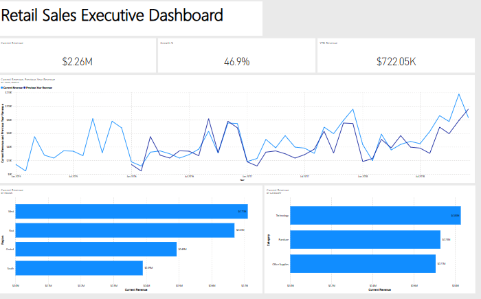
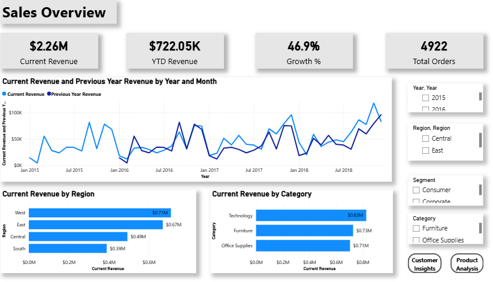
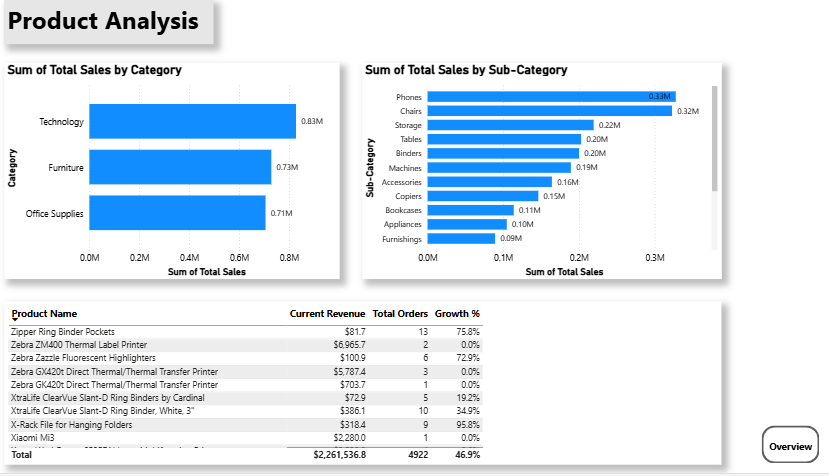
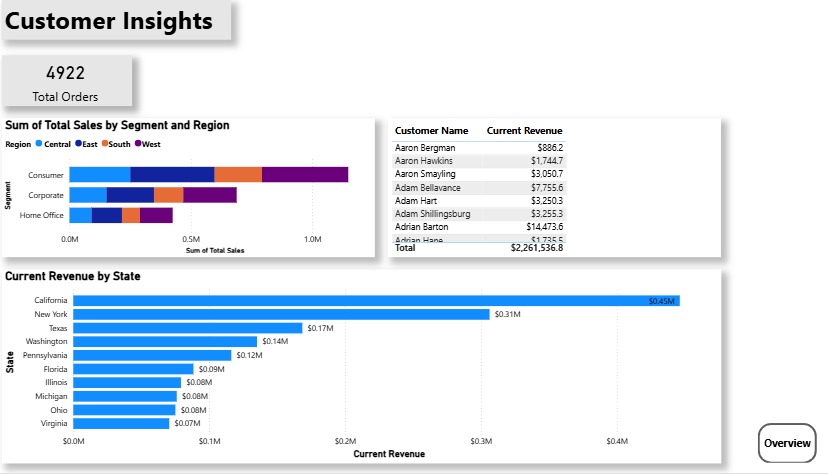
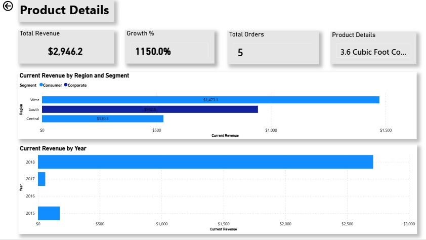

# Retail Sales Performance Analysis Using Power BI

## 📌 Project Overview

This project focuses on analyzing retail sales performance using Power BI.  
The dashboard provides insights into revenue trends, product performance, customer behavior, and regional sales analysis.

The project includes:
- Data cleaning in Power Query
- Data modeling
- DAX measures
- Time intelligence calculations
- Interactive report pages
- Drillthrough functionality
- Power BI Service dashboard

---

# 🛠 Tools & Technologies

- Power BI Desktop
- Power BI Service
- Power Query
- DAX
- Excel/CSV Dataset

---

# 📊 Dashboard Preview



---

# 📈 Report Pages

## Overview Page

Features:
- KPI cards
- Revenue trend analysis
- Current vs Previous Year comparison
- Revenue by region
- Revenue by category



---

## Product Analysis

Features:
- Revenue by category
- Revenue by sub-category
- Product performance table



---

## Customer Insights

Features:
- Revenue by segment
- Revenue by state
- Customer-level analysis



---

## Product Details (Drillthrough Page)

Features:
- Product drillthrough analysis
- Dynamic filtering
- Product-specific KPIs



---

# 📌 Key DAX Measures

```DAX
Current Revenue = SUM(Orders[Sales])

YTD Revenue =
TOTALYTD(
    [Current Revenue],
    'Date Table'[Date]
)

Previous Year Revenue =
CALCULATE(
    [Current Revenue],
    SAMEPERIODLASTYEAR('Date Table'[Date])
)

Growth % =
DIVIDE(
    [Current Revenue] - [Previous Year Revenue],
    [Previous Year Revenue]
)
```

---

# 📌 Key Features

- Interactive Power BI report
- Executive dashboard
- Time intelligence calculations
- Drillthrough functionality
- Dynamic filtering
- Data cleaning using Power Query
- Data modeling with relationships
- Professional dashboard design

---

# 📂 Project Structure

```text
Retail-Sales-PowerBI-Project/
│
├── Dataset/
├── PowerBI_File/
├── Screenshots/
└── README.md
```

---

# 🚀 Business Insights

Some insights identified from the analysis:
- Technology category generated the highest revenue
- West region contributed the most sales
- Revenue trends increased significantly toward 2018
- Consumer segment generated the largest share of revenue

---

# 👤 Author

Lindile Nkosi

- Power BI
- SQL
- Excel
- Data Analysis
- Data Visualization
